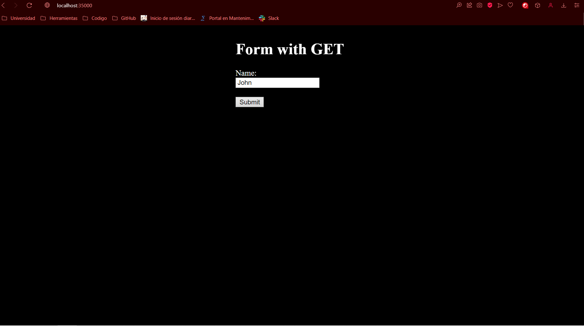
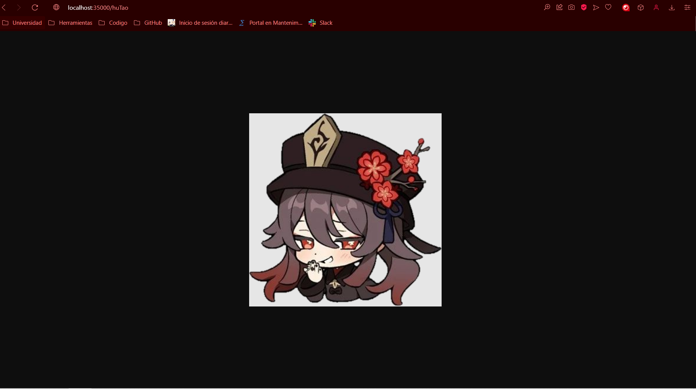
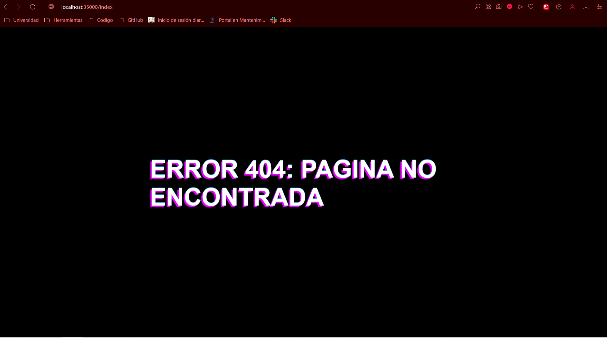

# AREP Taller 4
Construcción de un POJO mediante anotaciones las cuales nos permite identificar cuales clases van a ser usadas.
Este proyecto corresponde a la simulación de un servidor Web de tipo apache en Java. Es posible leer archivos 
HTML, CSS, JS e imagenes PNG y JPG.

## Iniciando

### Prerequisites

- Maven - Administrador de dependencias y administrador del ciclo de vida del proyecto
- Java - Ambiente de desarrollo
-  Git - Sistema de control de versiones y descarga del repositorio

### Instalando el entorno

Para correr el programa primero descargue el repositorio con el siguiente comando
```
git clone https://github.com/Derjasai/Arep_Lab04.git
```

Una vez clonado el repositorio ingrese en la carpeta descargada y corra el siguiente comando para ejecutar el programa

```
java -cp target/classes edu.eci.arep.app.App
```

Finalmente ingrese al navegador de su preferencia con el siguiente link:  http://localhost:35000/

En este caso se verá la página html que fue creada, en caso de buscar un servicio que no existe en el momento se le dirigirá a una página de error 404, por ejemplo usando el siguiente link:  
http://localhost:35000/a

Para poder ver una imagen png ingrese al siguiente link:  http://localhost:35000/huTao

## Pruebas realizadas

Como podemos ver en este caso estamos solicitando el recurso de index


Ahora vamos a hacer la consulta de la imagen png:


Finalmente, hacemos la consulta de un servicio que no fue agregado en las notaciones


## Documentación

Se puede encontrar la documentación en la carpeta nombrada "javadoc", para generar nueva documentación puede correr el siguiente comando
```
mvn javadoc:javadoc
```
La nueva documentación generada puede encontrarla en la ruta /target/site/apidocs

## Construido con

* [Maven](https://maven.apache.org/) - Dependency Management

## Versonamiento

Versión 1.0

## Autores

* Daniel Esteban Ramos Jimenéz

## Explicaciones tecnicas

Se hace una arquitectura enfocada en API Rest. Se implementa el patrón de diseño SINGLETON para la creación del microframework de spark, de esta forma solo necesitamos un spark el cual nos gestiona todos los métodos que el tiene y puede usar.

- Extensibilidad: El usuario puede buscar cualquier tipo de archivo que exista dentro de resources, incluyendo carpetas o directorios internos. El uso de funciones lambda nos permite hacer la creación y uso de diferentes servicios.
- Extensibilidad: Se hace una sola clase para el servicio de páginas web llamada PagesServices, la cual usa el patrón de diseño Singleton, con esto solo necesitamos pasarle el path y una extensión para poder visualizar un recurso que se tenga almacenado en disco, en lugar de crear un servicio por cada recurso que se quiera visualizar 
- Patrones usados: Se usa el patrón de Fachada y el patrón de Singleton
- Modularización: Todas clases implementan metodos los cuales singuel el principio de unica responsabilidad, lo cual nos permite extender el codigo de ser necesario en dado caso que se necesite